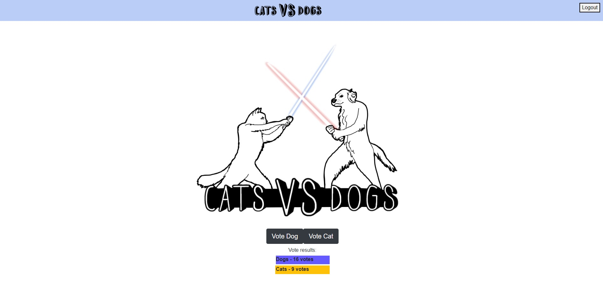
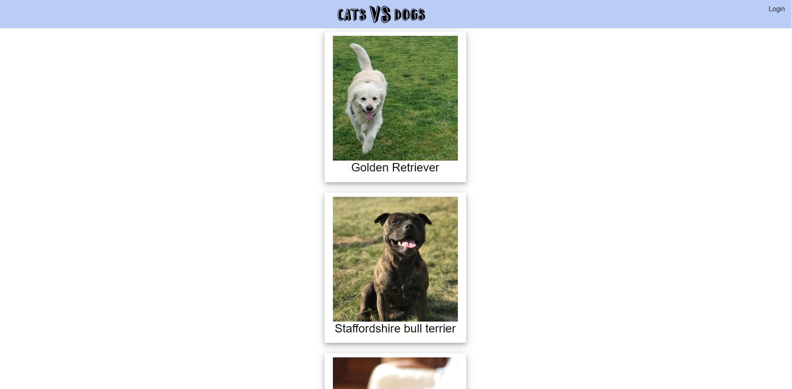
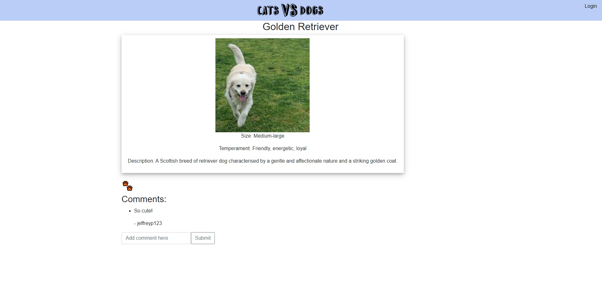

# Cats Vs Dogs

## Description
This application allows users to search for potential future pets, depending on whether they are a dog person or a cat person. They can view key stats/info on dog and cat breeds, read owner reviews and images, and upload their own comments and images as a user of the application.

## Collaborators
- Samantha S (http://github.com/Samantha-Sokolis)
- Jeffrey P (http://github.com/jpjp2328)
- Nimeash T (http://github.com/NT399)

## Inspiration
Over the last few years, may it be due to covid-19, a trend in raising pets had been on the incline. The most popular pets to own are of course the classic dogs and cats. As a fellow pet owner, we understand the difficulty in deciding your first pet as well as the desire to share your images of your beloved friend. We wanted to create a fun application, hence (Dogs vs cats), a space where pet lovers or people who are looking for future pets can enjoy and share their love for these animals.

## Table of Contents
- [Deployment](#deployment)
- [Installation](#installation)
- [Usage](#usage)
- [Demo](#demo)
- [Technology](#technology)
- [Credits](#credits)
- [Tests](#tests)
- [Future Development](#future-development)
- [License](#license)

## Deployment
Heroku URL - https://catsvsdogs1.herokuapp.com/

## Installation
- To install necessary dependencies, run the following commands:
npm i OR npm install

- Note that the herokuapp deployment would have the dependencies and seeding pre-installed

## Usage
- Visit the deployed application to use.
- Users would be directed to the homepage of 'Cats Vs Dogs' Where they can vote, log in, browse cats/dogs, view the available breeds in our db as well as commenting on these breeds using an logged in account.

- Backend (Run application locally)
  - To create the database using schema.sql, open MySQL terminal (Mysql -u root -p) in the 'db' folder. Once logged into the MySQL terminal by inputting your password. type 'SOURCE schema.sql'. Your database would then be created and you can simply exit MySQL terminal by typing 'exit'.
  - Alternatively, you can open MySQL terminal anywhere, log into MySQL, and type 'SOURCE C:\\(filepath)\cats-vs-dogs\db\schema.sql' 
  - To seed the data, type 'npm run seed' in the terminal in 'cats-vs-dogs' directory.
  - To run the application in local, type 'npm start' in the terminal. Note that you have to be in the directories location where the dependencies had been installed (in this case the folder 'cats-vs-dogs') to run the application.

## Demo

## Technology
- Javascript
- MySQL
- node.js
- CSS
- Project management (Kaban board)
- npm packages/dependencies include: dotenv, express, mysql2, sequelize, bycrypt, connect-session-sequelize, express-handlebars, express-sessions, cloudinary
- testing: Insomnia

## Credits

The following resources were referenced to ensure best practice and adherence to appropriate conventions:

TBA

References for Seed Data:
https://www.purina.com/cats/cat-breeds
https://dogtime.com/dog-breeds/profiles

Cloudinary:
https://cloudinary.com/documentation/node_integration
Tutorial 
https://www.youtube.com/watch?v=-6TUfJTBR1c

## Tests
- API routes could be tested through Insomnia 

## Future development
- User profile page where users can upload pictures of their own dog/cat via cloudinary npm package and share/show to other users.
- Ability to upvote/like a specific dog/cat breed on the animal contents page (done through editing the model/api routes), which then would give users an option to look for most popular dog/cats
- Ability to reply to comments, space where discussions and tips can be shared among users
- Idea - Include more pet variety, other than just cats and dogs.
- Include pet adoption api's where users would have an option to look for available dogs/cats to adopt depending on what they selected.

## License
- This project is licensed under MIT license.

